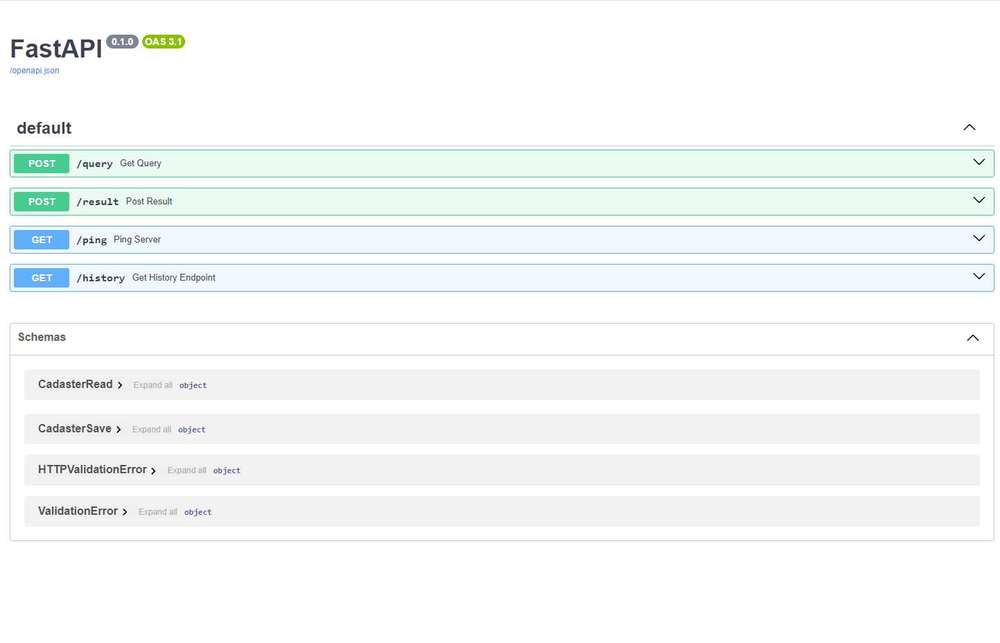
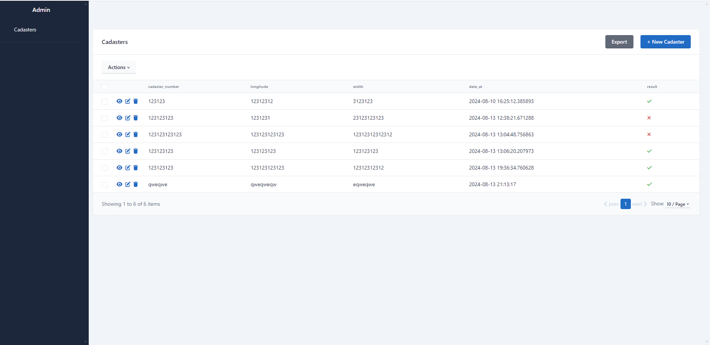

# ***Cервис, который принимает запрос с указанием кадастрового номера, широты и долготы, эмулирует отправку запроса на внешний сервер***
___
# Проект работает в Docker-compose network
___
# Запуск проекта:
### 1. Клонировать репозиторий через терминал 
```commandline
git clone https://github.com/IlyaKovalchukKIS/Cadastral.Service.API.git
```  
### 2. Нобходимо переименовать файл [.env.example](.env.example) в ```.env``` и добавить в него свои переменные.
* ### 3. Скачать и установить [Docker](https://www.docker.com/)
* ### 4. Выполнить комманды
```commandline
docker-compose build
```
```commandline
docker-compose up -d
```
```commandline
 docker compose exec app alembic upgrade head
```
### 5. Для просмотра документации перейти по адресу http://127.0.0.1:8000/docs/
## Пример API Документации 
### 6. Адмн панель доступна по адресу http://127.0.0.1:8000/admin/
## Админ-панель 